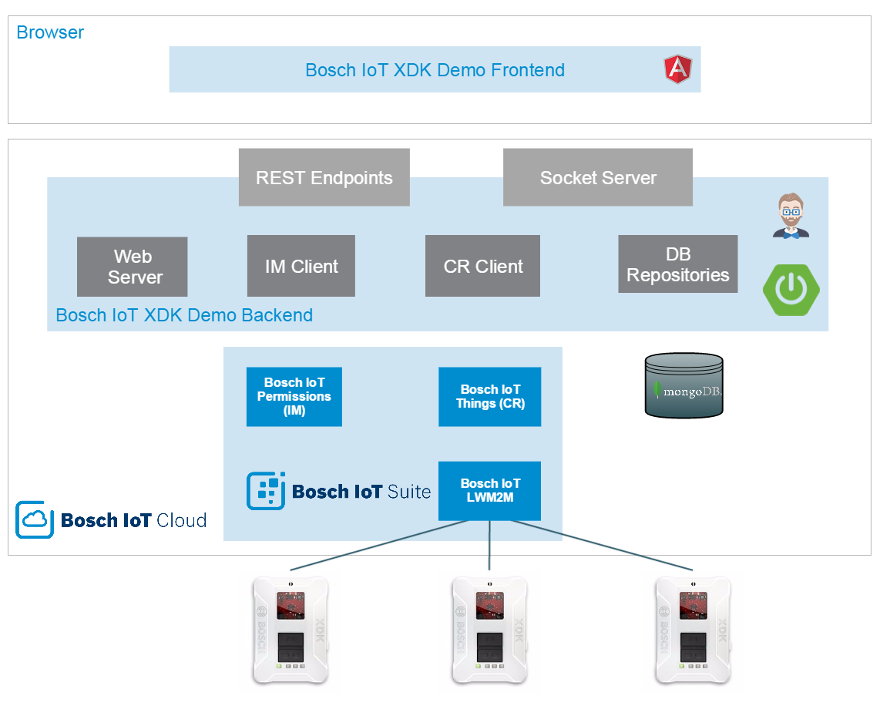

#Getting Started with the Bosch IoT XDK Demo App#
This Getting Started guide will help you set up your environment for XDK and Bosch IoT Cloud development. It will guide you through all the necessary steps using the Bosch IoT XDK Demo App as an example. The app's purpose is to demonstrate how sensor data can be persisted, visualized and used in a cloud environment using the Bosch IoT Suite services.

>Note: If you have received this guide **prior to the event**, here are some steps you can already start with:   
> 1. Start with checking the prerequisites and downloading the necessary software specified [below](#prerequisites-and-resources).  
> 2. Get your cloud development environment ready, following the [Setup your Cloud Development Environment](#setup-your-cloud-development-environment) chapter.  
> 3. Get familiar with the [architecture](#architecture) of the Bosch IoT XDK Demo App.  
> 4. Look through the documentation of the used software components specified [here](#further-documentation).

##Overview##

<a name="prerequisites-and-resources"></a>
### Prerequisites and Resources ###
To complete this guide you will need a computer with local admin privileges to install the necessary software and drivers. See the following list of prerequisites:

- Windows 64-bit system for the XDK Workbench
- Local admin privileges or the privileges to install software on your system
- Installed Oracle Java Development Kit 1.8 from [Download Oracle JDK 1.8][lnk_dl_OracleJDK1.8]
- SD memory card slot
- Free USB port

Additionally you will have to **download the following software** (installation will be part of the guide):

- Command line [Git][lnk_dl_git] client
- The latest (stable) [node.js][lnk_dl_nodejs] with Node Package Manager
- The latest [Cloud Foundry CLI][lnk_dl_cf_cli]
- IDE for Java development of your choice e.g. [Eclipse IDE][lnk_dl_eclipse_ide] or [IntelliJ Communitiy Edition][lnk_dl_intellij_ide]
- [Apache Maven][lnk_dl_maven] (starting with 3.0.0) if it is not already embedded in your IDE


You will get the following things from your Hack MC. Please check if you have got everything before starting the tutorial.

- The [Bosch XDK device][lnk_info_xdk] boxed together with a breakout-board incl. connector and USB cable
- micro SD memory card containing the XDK Workbench, the Bosch IoT XDK Demo firmware and other needed software artifacts
- micro SD card adapter
- WiFi information


### Architecture ###

The image below shows you the architecture overview of the Bosch IoT XDK Demo App.




The XDK Firmware implements the LWM2M protocol (CoAP-based) to communicate with the LWM2M Server in the cloud. The LWM2M server has an adapter to communicate with the Bosch IoT Things service (formerly known as Central Registry or CR). The Backend of the Bosch IoT XDK Demo App implements a client for the CR Service as a single point of access to the XDK. In addition, the Demo App uses a DB service (MongoDB) to persist sensor data (similar to a time series DB) and implements the Identity Management (IM) Java Client for user authentication & authorization. The Demo App also provides a web-based user interface to display XDK sensor data and to configure the XDK device (e.g. control the LED lamps). 

## Instructions##

###Overview of the Steps###

1. [Setup the XDK](#xdk-setup)
2. [Setup your Cloud Development Environment](#setup-your-cloud-development-environment)
3. [Setup your Cloud Space](#setup-your-cloud-space)
4. [Deploy your Cloud App](#deploy-the-bosch-IoT-XDK-demo-app)
5. [Check your Results](#check-your-results)

<a name="xdk-setup"></a>
### XDK Setup ###

As a first step you will install the XDK Workbench, configure and flash your XDK to work with the Bosch IoT XDK Demo App.

1. Copy the contents of the micro SD memory card to a sensible location on your system (called `...\yourLocation\` from now on).
 
2. Install the XDK Workbench using the installer you can find in `...\yourLocation\install_XDK-1.x.x-...-x86_64.exe`. During the installation the XDK device driver will be installed to your system. Make sure you have admin privileges on execution of the installer.

3. Import the LWM2M firmware into your Workbench
  1. Open the **XDK Workbench** and specify a workspace location when prompted.
  2. Make sure to import the provided firmware `XDK_LWM2M_Firmware.zip` as an *Existing Project into Workspace*.
  3. You can either import the zip archive directly or the extracted directory.

4. Open the `...\yourLocation\config.txt` file and enter the IP of the LWM2M Server and the provided WiFi settings  at the appropriate position as shown in the example below, if it is not already set: 

		SSID = <ProvidedSSID>
		PWD = <ProvidedPWD>
		LWM2MDEFSRV = coap://185.112.178.178:5683

5. Save the changes and copy `...\yourLocation\config.txt` to the root folder of the micro SD memory card, replacing the old *...config.txt* file.

6. Connect the XDK to your system using the USB cable. A green LED will show you that the battery is charging.

7. Start the XDK by flipping the ON/OFF switch. It should start in bootloader mode.

	> Note: To make sure the the XDK is in bootloader mode, flip the ON/OFF switch to the ON position, while pressing down button 1 (marked with one dot).

8. In your *XDK Workbench* in the *XDK Devices* window you should see the XDK device connected through the COM port and also the mode in which it is. Select the LWM2M project folder in the *Project Explorer* and click the **Flash** button in the *XDK Devices* window. The workbench will now flash the XDK with the LWM2M firmware.

	> Caution! When inserting the micro SD memory card into the XDK, make sure to put it in correctly into the slot, as it is easily misplaced and falls into the XDK case.

9. When finished turn off the XDK and insert the micro SD memory card with the configuration file into the XDK's micro SD slot.
10. Turn on the XDK. It will now send its data to the LWM2M server running in the cloud using the LWM2M protocol.


<a name="setup-your-cloud-development-environment"></a> 
### Setup your Cloud Development Environment  ###

In this part you will install and prepare all the necessary software for your cloud development environment together. The cloud application has been generated and developed with [JHipster][lnk_info_docs_jhipster] a Yeoman based generator to create a Spring Boot + AngularJS project.

> Note: The following instructions are only valid, if you have local admin privileges on your computer. If you don't, you can follow the alternative path [here (no admin guide for Windows)](dev_guide.md#Setup-your-Cloud-Development-Environment-without-Admin-Rights-Windows). 

1. Install Oracle Java JDK 1.8 from [Oracle Java JDK 8 Download Site][lnk_dl_OracleJDK1.8], if it is not already installed.
2. Download and install your preferred IDE, if it is not already installed.
3. Install Apache Maven, if it is not already installed or embedded in your IDE.
4. Install Git for your command line.  
  If installing on a Windows system choose the following options when prompted:
  1. "Use Git from the Windows Command Prompt"
  2. "Use OpenSSH"
  3. "Checkout Windows-style, commit Unix-style line endings"
  4. "Use Windows' default console window"
5. Install the Cloud Foundry CLI as described in [Cloud Foundry Command Line Tool Documentation][lnk_inst_cf_cli]
6. Install node.js. It will include the node package manager (npm).

	> Note: If you are behind a proxy *npm* will need seperate proxy configuration before you can us it. Check out the instructions [here](http://jjasonclark.com/how-to-setup-node-behind-web-proxy/).
  
7. Using npm install Yeoman, Bower, Grunt and the JHipster generator by typing in the following four commands one after another:  
`npm install -g yo`  
`npm install -g bower`  
`npm install -g grunt-cli`  
`npm install -g generator-jhipster`  

<a name="setup-your-cloud-space"></a>
###  Setup your Cloud Space  ###

In this step you will set up your Bosch IoT Cloud Space to prepare it for XDK CloudApp deployment.

> Note: Your space has the name *HackXX* where *XX* stands for an arbitrary number between 01 and 50. This number is your unique identifier that will be used in several places throughout this guide. Simply replace *XX* whith your number wherever you see it in the guide.

1. Check your mail account:
  1. You should have received an invitation email from your Hack MC.  
  ![Cloud Invite][img_cloudinvite]  
  2. Click on the **Accept invitation** link to open the Bosch IoT Cloud Development Console in your browser.  initially you will be prompted to set a password.  
  3. Select your *HackXX* space by clicking on it.  
  ![Overview of XDKCloud org in the developer console][img_cloudorg_empty]  
2.  Add the *MongoDB* service to your space:
  1. In your space click on the **Add Service** button.  
  ![Empty space in the developer console][img_cloudspace_empty]  
  2. Select the *MongoDB* Service.  
  ![IoT marketplace][img_marketplace]  
  3. Choose the *Shared MongoDB Silver - QA* service plan and click on **Select this plan**.  
  ![Select plan][img_selectplan_mongo]  
  4. In the following dialog use `xdk_service_storage` for the service instance id.
  5. Select your *HackXX* space and hit the **Add** button.  
  ![Service details for mongo DB][img_serviceadd_mongo]  
3. Add the *Bosch IoT Things* service (formerly known as Central Registry) to your space in the same fashion using the following details:
  1. Choose the *Free* service plan.
  2. Name your service instance `xdk_service_cr`.
  3. Choose your *HackXX* space.   
  ![Service details for Bosch IoT Central Registry][img_serviceadd_cr]  
4. Add the *Bosch IoT Permissions* service (formerly known as Identity Management) to your space.
  1. Choose the *Free* service plan.
  2. Name your service instance `xdk_service_im3`.
  3. Choose your *HackXX* space.   
  ![Service details for Bosch IoT Identity Management][img_serviceadd_im3]  
<a name="nav_appcredentials"></a>
5. Change your initial IM Administrator password.
  1. Click on the **Manage** link of your IM3 service to open the Identity Management Admin UI.  
  ![Space with added services in the developer console][img_cloudspace_full_im3]  
  2. Click on **Login** on the upper left.  
  ![IM3 service management][img_servicemgr_im3]  
  3. Use the following credentials for first time login:  
*User:* `Admin`  
*Password:* `ChangeThis1!`  
  ![IM3 intitial login][img_im3_initlogin]  
  4. Change your password when prompted and remember it, as these will be your admin user credentials within your application. 

<a name="deploy-the-bosch-IoT-XDK-demo-app"></a>
### Deploy the Bosch IoT XDK Demo App ###

In this section you will prepare and build the Bosch IoT XDK Demo App and push it to your space in the cloud.


####Setup Bosch IoT Things (Central Registry) ####

To authenticate the Demo App at the Bosch IoT Things service, you will need a public private key pair and publish the public key to the Bosch IoT Central Registry.

1. Using the Java keytool which is part of the JDK 1.8 create a keystore and generate a certificate with the following command.  
```
keytool -genkeypair -noprompt -dname "CN=-, OU=-, O=-, L=-, S=-, C=-" -keyalg EC -alias CR -sigalg SHA512withECDSA -validity 365 -keystore CRClient.jks
```  
	> Note: This will create a CRClient.jks file in the path you are executing this command from. You will need this file later when [building your app](#deploy-the-bosch-IoT-XDK-demo-app). 

2. When prompted enter a keystore password and an alias password and remember them.
	>Note: You will be storing these in a plain text file later so please use a new password and not one of your personal ones.  
	> You can set seperate passwords for the keystore and for the alias, though to keep it simple, we recommend using the same one. 

3. Use the following commands to export the public key to a certificate file and print the public key to the console.  
`keytool -export -keystore CRClient.jks -alias CR -rfc -file CRClient_key.cer`   
and  
`keytool -printcert -rfc -file CRClient_key.cer`  
4. Copy the text representation including `—–BEGIN CERTIFICATE—–` down to `—–END CERTIFICATE—–` into the clipboard as in the example below.  
    ![Example of public key][img_cpycert]  
   
5. In your browser go to your space in the Bosch IoT Cloud and open the "Manage" dialog of your Bosch IoT Things (Central Registry) service instance.  
![Space with added services in the developer console][img_cloudspace_full_cr]  
6.  There you will find a "Submit your Public Key" frame, where you can paste your public key to. Finish by hitting the "Submit Public Key" button.  
![Manage your Bosch IoT Central Registry service instance][img_servicemgr_cr]  

#### Prepare the Bosch IoT XDK Demo App ####

>Note: You will need your unique identifier which is a two-digit number represented using *XX* and can be read from your cloud space name *hackXX*.

1. Import the Bosch IoT XDK Demo App to your IDE from the `XDK_Cloud_App.zip` file as a Maven project.

<a name="nav_use_jks"> </a>
2. Copy the above created CRClient.jks keystore to the "src/main/resources/keystore/" folder of the Demo App.  
![Resulting project path structure][img_projectpath]  
3. Go to "deploy/cloudfoundry/manifest.yml" and change the name of the app to make it unique. See below example (replace *XX* with your unique identifier).

		---
		path: xdkcloudapp-1.0.0-SNAPSHOT.war
		instances: 1
		buildpack: https://github.com/cloudfoundry/java-buildpack
		services:
		- xdk_service_im3
		- xdk_service_storage
		- xdk_service_cr
		applications:
		- name: xdkcloudappXX
		domain: bcx.bosch-iot-cloud.com
		env:
			SPRING_PROFILES_DEFAULT: prod  


4. In "src/main/resources/config/application-prod.yml" change the Central Registry settings on the bottom to include the passwords you have set when creating the keystore. Use the snippet below as an example (replace everything in <>).  
	
		...
		
		# ===================================================================
		# Cloud Services specific properties
		# ===================================================================
		
		cr:
		  alias: CR
		  aliasPassword: <addMe>
		  keyStorePath: /keystore/CRClient.jks
		  keyStorePassword: <addMe>
		  sslKeyStorePath: /keystore/bosch-iot-cloud.jks
		  sslKeyStorePassword: jks
		  applicationNamespace: com.bosch.bcx.demo
		
		...
 
6. You can now build your app using Maven package, skipping the test phase and using the "prod" profile. From the command line in the `./CloudApp/` directory this would result in the following command:  
`mvn -Pprod package -DskipTests`

#### Push your App to the Cloud ####

1. You are now ready to push your app to the cloud using the Cloud Foundry CLI. First set up your Cloud Foundry CLI to use your space using the following command and completing the dialog that follows.  
`cf login --skip-ssl-validation -a https://api.sys.bosch-iot-cloud.com`  

    ![cf login example from the windows cmd][img_cfcli_login]  

2. Change to the "CloudApp/target" directory of your project. Use the following command to push the app to the cloud.  
`cf push`  

<a name="check-your-results"></a>
### Check your Results ###

>Note: You will need your unique identifier which is represented using *XX* and can be read from your cloud space name *hackXX*.

1. To go to the UI of your XDK Cloud App use the following link: *http://xdkcloudappXX.bcx.bosch-iot-cloud.com* (replace XX with your unique identifier).
2. Use your admin user credentials to login. You have created them [when setting up the Identity Management](#nav_appcredentials).
3. Go to the **Configuration** tab.
4. Open the **Claim new XDK** dialog, enter the *MAC address* printed on the back of your XDK under *WLAN* and hit **Claim Thing**.  
  ![Picture of XDK - backside][img_XDKback]  
5. Your XDK should now appear under **Your claimed XDKs**.
6. Open the **Dashboard**, select your XDK from the drop-down menu and observe it, while shaking or turning your XDK.  
  ![Dashboard of the Bosch IoT XDK Demo App][img_appdashboard]  
7. Try to switch the LED lamps using the Dashboard.
8. Congratulations you have finished the *Getting Started* guide. For more insight have a look into the code using one of the following guides and documentations. Happy hacking!

<a name="further-documentation"></a> 
#### Further Documentation ####


- [Running the Bosch IoT XDK Demo App locally](dev_guide.md#Run-the-Demo-App-Locally)
- [ReadMe Bosch IoT XDK Demo App][lnk_info_docs_readme]
- [Bosch XDK Documentation][lnk_info_xdk_docu] 
- [Bosch IoT Things (Central Registry) Documentation][lnk_info_docs_cr]
- [Bosch IoT Permissions (Identity Management) Developer Guide][lnk_info_docs_im3]
- [Cloud Foundry Documentation][lnk_info_docs_cf]
- [JHipster Web Site][lnk_info_docs_jhipster]
- [Link to Bosch IoT Cloud Developer Console](https://apps.sys.bosch-iot-cloud.com)
- [Running the Bosch IoT XDK Demo App locally](dev_guide.md#understanding-the-code)

[//]: # (internal docu links)

[lnk_info_docs_readme]: ../../README.md

[//]: # (bosch links)

[lnk_info_docs_cr]: http://m2m.bosch-si.com/dokuwiki/doku.php
[lnk_info_docs_im3]: https://im3.apps.bosch-iot-cloud.com/fusion/app/im-docu-dev
[lnk_info_xdk_docu]: http://xdk.bosch-connectivity.com/examples
[lnk_info_xdk]: http://xdk.io

[//]: # (external links)

[lnk_dl_OracleJDK1.8]: http://www.oracle.com/technetwork/java/javase/downloads/jdk8-downloads-2133151.html
[lnk_dl_intellij_ide]: https://www.jetbrains.com/idea/download/
[lnk_dl_eclipse_ide]: http://www.eclipse.org/downloads/
[lnk_dl_git]: http://git-scm.com/downloads
[lnk_dl_nodejs]: https://nodejs.org/en/download/
[lnk_dl_cf_cli]: https://github.com/cloudfoundry/cli#downloads
[lnk_inst_cf_cli]: http://docs.cloudfoundry.org/devguide/cf-cli/install-go-cli.html
[lnk_dl_maven]: https://maven.apache.org/download.cgi
[lnk_info_docs_jhipster]: https://jhipster.github.io/
[lnk_info_docs_cf]: http://docs.cloudfoundry.org/


[//]: # (local images)

[img_architecture]: ./resources/img/xdk_cloudAppArchitecture.png
[img_boschlogo]: ./resources/img/bosch_logo_german.png
[img_cloudinvite]: ./resources/img/img_CloudInvite.png
[img_cloudpw]: ./resources/img/img_cloudpw.png
[img_cloudorg_empty]: ./resources/img/img_cloudorg_empty.png
[img_cloudspace_empty]: ./resources/img/img_cloudspace_empty.png
[img_marketplace]: ./resources/img/img_marketplace.png
[img_selectplan_mongo]: ./resources/img/img_selectplan_mongo.png
[img_serviceadd_mongo]: ./resources/img/img_serviceadd_mongo.png
[img_serviceadd_cr]: ./resources/img/img_serviceadd_cr.png
[img_serviceadd_im3]: ./resources/img/img_serviceadd_im3.png
[img_cloudspace_full_im3]: ./resources/img/img_cloudspace_full_im3.png
[img_servicemgr_im3]: ./resources/img/img_servicemgr_im3.png
[img_im3_initlogin]: ./resources/img/img_im3_initlogin.png
[img_cpycert]: ./resources/img/img_cpycert.png
[img_cloudspace_full_cr]: ./resources/img/img_cloudspace_full_cr.png
[img_servicemgr_cr]: ./resources/img/img_servicemgr_cr.png
[img_projectpath]: ./resources/img/img_projectpath.png
[img_cfcli_login]: ./resources/img/img_cfCLI_login.png
[img_xdkback]: ./resources/img/img_xdkback.png
[img_appdashboard]: ./resources/img/img_appdashboard.png